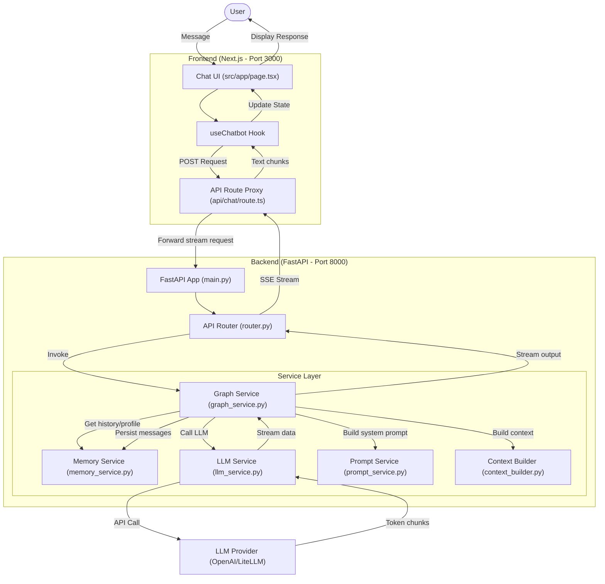
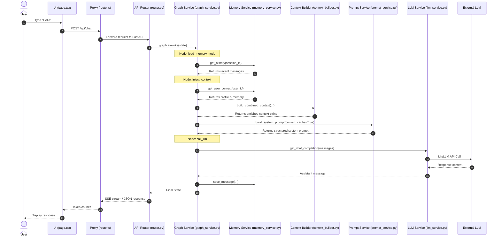

# Data Flow Diagram

This diagram illustrates the flow of data from the user interface through the various backend layers.

## Data Sequence Diagram

This sequence diagram detail the step-by-step interaction between components for a single chat message.

## Description of Components

1.  **Frontend (UI)**: React components that render the chat interface and manage user input state.
    -   **File**: `web/src/app/page.tsx`
    -   **Hook**: `useChatbot` (manages message state and streaming).

2.  **Next.js Proxy**: Acts as a gateway to handle CORS and hide the internal backend URL.
    -   **File**: `web/src/app/api/chat/route.ts` (POST handler).

3.  **FastAPI Backend**: The core logic server that handles session management and orchestration.
    -   **EntryPoint**: `src/main.py`
    -   **Routing**: `src/api/router.py` (orchestrates graph invocation).

4.  **Memory Service**: Manages conversation history and user profiles.
    -   **File**: `src/services/memory_service.py`
    -   **Methods**: `get_history()`, `get_user_context()`, `save_message()`.

5.  **Context Builder**: Logic for assembling various data points into a coherent context string.
    -   **File**: `src/services/context_builder.py`
    -   **Method**: `build_combined_context()`.

6.  **Prompt Service**: Manages Jinja2 templates for system prompts with `cache_control` support.
    -   **File**: `src/services/prompt_service.py`
    -   **Method**: `build_system_prompt()`.

7.  **Graph Service**: The central orchestrator (using LangGraph) identifying nodes and transitions.
    -   **File**: `src/services/graph_service.py`
    -   **Methods**: `load_memory_node()`, `context_injection_node()`, `call_llm_node()`.

8.  **LLM Service**: Handles communication with external AI providers using LiteLLM/OpenAI.
    -   **File**: `src/services/llm_service.py`
    -   **Methods**: `get_chat_completion()`, `get_chat_stream()`.
