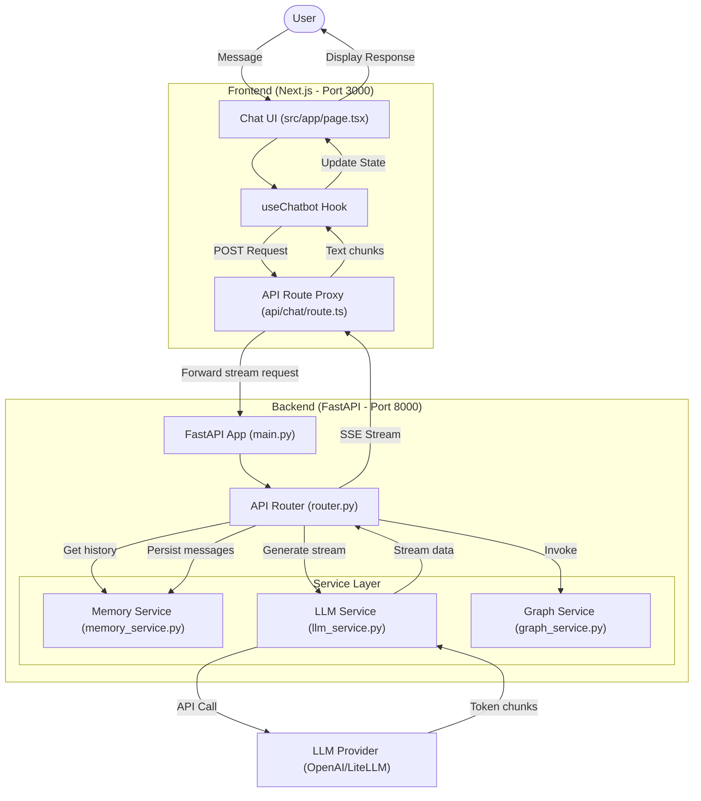

# Data Flow Diagram

This diagram illustrates the flow of data from the user interface through the various backend layers.

## Description of Components

1.  **Frontend (UI)**: React components that render the chat interface and manage user input state.
2.  **Next.js Proxy**: Acts as a gateway to handle CORS and hide the internal backend URL. It transforms SSE (Server-Sent Events) from the backend into a format the frontend hook expects.
3.  **FastAPI Backend**: The core logic server that handles session management and orchestration.
4.  **Memory Service**: Manages short-term conversation history for each session.
5.  **LLM Service**: Handles communication with external AI providers using LiteLLM/OpenAI.
6.  **Graph Service**: (Optional) Uses LangGraph to manage complex multi-step reasoning or tool-calling flows.
