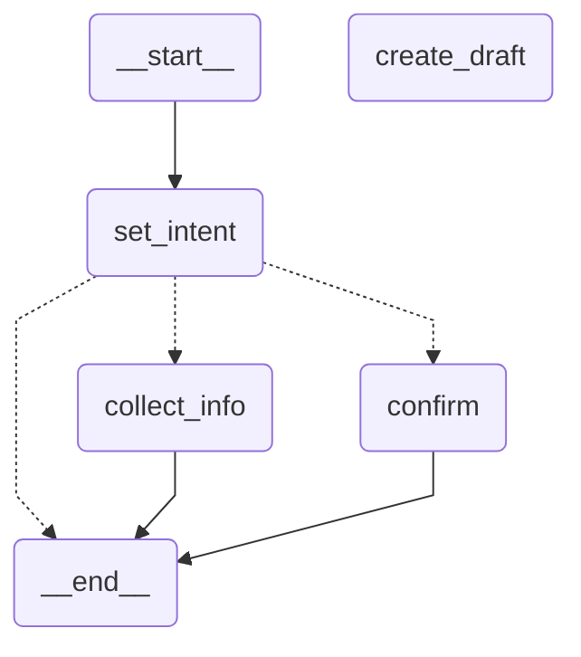

```mermaid
---
config:
  flowchart:
    curve: linear
---
graph TD;
	__start__(<p>__start__</p>)
	set_intent(set_intent)
	collect_info(collect_info)
	create_draft(create_draft)
	confirm(confirm)
	__end__(<p>__end__</p>)
	__start__ --> set_intent;
	set_intent -.-> __end__;
	set_intent -.-> collect_info;
	set_intent -.-> confirm;
	collect_info --> __end__;
	confirm --> __end__;
	classDef default fill:#f2f0ff,line-height:1.2
	classDef first fill-opacity:0
	classDef last fill:#bfb6fc

```