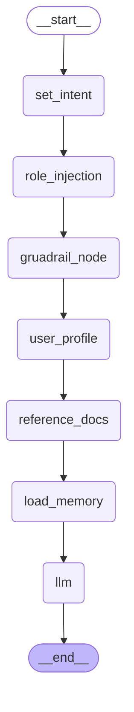

```mermaid
---
config:
  flowchart:
    curve: linear
---
graph TD;
	__start__([<p>__start__</p>]):::first
	set_intent(set_intent)
	role_injection(role_injection)
	gruadrail_node(gruadrail_node)
	user_profile(user_profile)
	reference_docs(reference_docs)
	load_memory(load_memory)
	llm(llm)
	__end__([<p>__end__</p>]):::last
	__start__ --> set_intent;
	gruadrail_node --> user_profile;
	load_memory --> llm;
	reference_docs --> load_memory;
	role_injection --> gruadrail_node;
	set_intent --> role_injection;
	user_profile --> reference_docs;
	llm --> __end__;
	classDef default fill:#f2f0ff,line-height:1.2
	classDef first fill-opacity:0
	classDef last fill:#bfb6fc

```