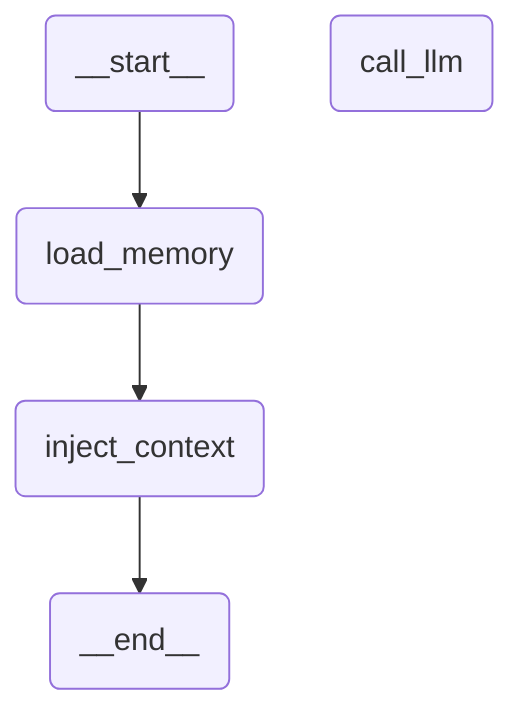

```mermaid
---
config:
  flowchart:
    curve: linear
---
graph TD;
	__start__(<p>__start__</p>)
	load_memory(load_memory)
	inject_context(inject_context)
	call_llm(call_llm)
	__end__(<p>__end__</p>)
	__start__ --> load_memory;
	load_memory --> inject_context;
	inject_context --> __end__;
	classDef default fill:#f2f0ff,line-height:1.2
	classDef first fill-opacity:0
	classDef last fill:#bfb6fc

```