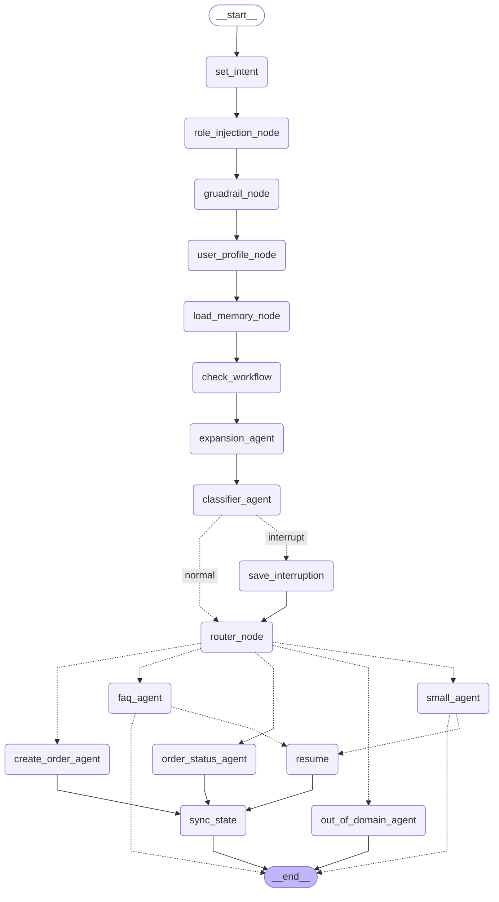

```mermaid
---
config:
  flowchart:
    curve: linear
---
graph TD;
	__start__([<p>__start__</p>]):::first
	set_intent(set_intent)
	role_injection_node(role_injection_node)
	gruadrail_node(gruadrail_node)
	user_profile_node(user_profile_node)
	load_memory_node(load_memory_node)
	check_workflow(check_workflow)
	expansion_agent(expansion_agent)
	classifier_agent(classifier_agent)
	save_interruption(save_interruption)
	resume(resume)
	sync_state(sync_state)
	small_agent(small_agent)
	faq_agent(faq_agent)
	order_status_agent(order_status_agent)
	create_order_agent(create_order_agent)
	out_of_domain_agent(out_of_domain_agent)
	router_node(router_node)
	__end__([<p>__end__</p>]):::last
	__start__ --> set_intent;
	check_workflow --> expansion_agent;
	classifier_agent -. &nbsp;normal&nbsp; .-> router_node;
	classifier_agent -. &nbsp;interrupt&nbsp; .-> save_interruption;
	create_order_agent --> sync_state;
	expansion_agent --> classifier_agent;
	faq_agent -.-> __end__;
	faq_agent -.-> resume;
	gruadrail_node --> user_profile_node;
	load_memory_node --> check_workflow;
	order_status_agent --> sync_state;
	resume --> sync_state;
	role_injection_node --> gruadrail_node;
	router_node -.-> create_order_agent;
	router_node -.-> faq_agent;
	router_node -.-> order_status_agent;
	router_node -.-> out_of_domain_agent;
	router_node -.-> small_agent;
	save_interruption --> router_node;
	set_intent --> role_injection_node;
	small_agent -.-> __end__;
	small_agent -.-> resume;
	user_profile_node --> load_memory_node;
	out_of_domain_agent --> __end__;
	sync_state --> __end__;
	classDef default fill:#f2f0ff,line-height:1.2
	classDef first fill-opacity:0
	classDef last fill:#bfb6fc

```