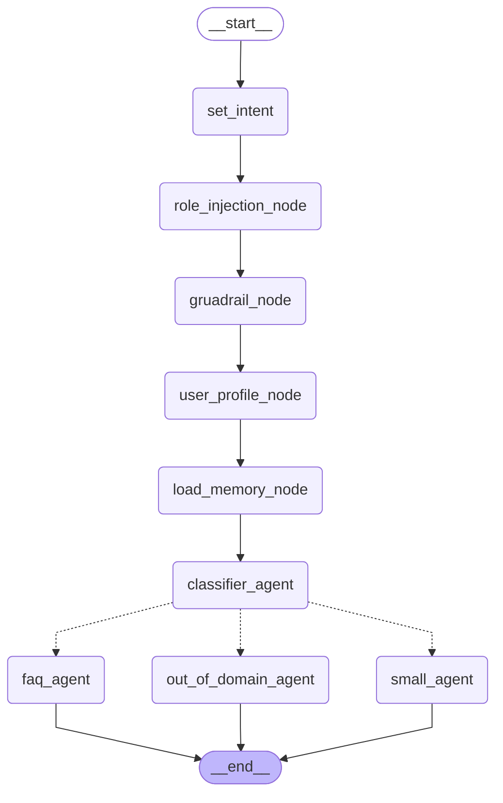

```mermaid
---
config:
  flowchart:
    curve: linear
---
graph TD;
	__start__([<p>__start__</p>]):::first
	set_intent(set_intent)
	role_injection_node(role_injection_node)
	gruadrail_node(gruadrail_node)
	user_profile_node(user_profile_node)
	load_memory_node(load_memory_node)
	classifier_agent(classifier_agent)
	small_agent(small_agent)
	faq_agent(faq_agent)
	out_of_domain_agent(out_of_domain_agent)
	__end__([<p>__end__</p>]):::last
	__start__ --> set_intent;
	classifier_agent -.-> faq_agent;
	classifier_agent -.-> out_of_domain_agent;
	classifier_agent -.-> small_agent;
	gruadrail_node --> user_profile_node;
	load_memory_node --> classifier_agent;
	role_injection_node --> gruadrail_node;
	set_intent --> role_injection_node;
	user_profile_node --> load_memory_node;
	faq_agent --> __end__;
	out_of_domain_agent --> __end__;
	small_agent --> __end__;
	classDef default fill:#f2f0ff,line-height:1.2
	classDef first fill-opacity:0
	classDef last fill:#bfb6fc

```