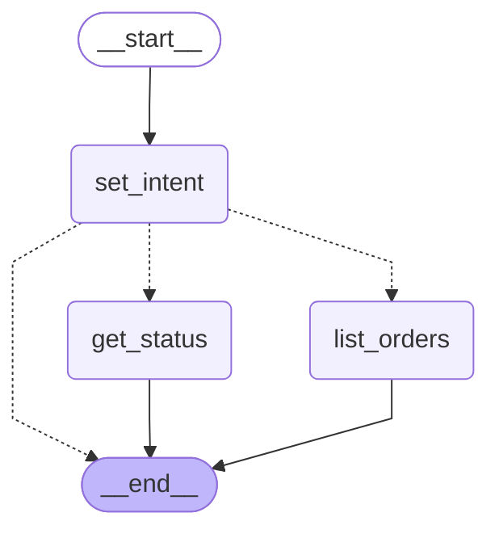

```mermaid
---
config:
  flowchart:
    curve: linear
---
graph TD;
	__start__([<p>__start__</p>]):::first
	set_intent(set_intent)
	list_orders(list_orders)
	get_status(get_status)
	__end__([<p>__end__</p>]):::last
	__start__ --> set_intent;
	set_intent -.-> __end__;
	set_intent -.-> get_status;
	set_intent -.-> list_orders;
	get_status --> __end__;
	list_orders --> __end__;
	classDef default fill:#f2f0ff,line-height:1.2
	classDef first fill-opacity:0
	classDef last fill:#bfb6fc

```