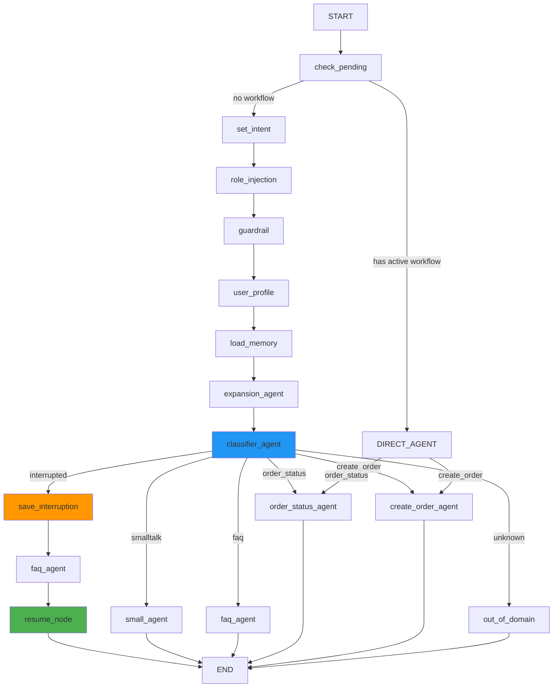

# Phase 4: Main Orchestrator — LangGraph Workflow with Journey Resume

## Objective
The main orchestrator graph handles **intent classification → agent routing → workflow interruption → journey resume**. This is the heart of the system.

---

## Sub-Phases (Cross-Cutting Improvements)

| Phase | File | Description |
|---|---|---|
| [**Phase 4A**](./phase_4a_conversation_state_manager.md) | `conversation_state_manager.py` | Persistent state lifecycle manager — tracks `current_agent`, `workflow_step`, `pending_action`, handles interrupt/resume, TTL-based expiration |
| [**Phase 4B**](./phase_4b_tool_router.md) | `tools/registry.py` | Dynamic ToolRegistry — register, discover, validate, and invoke tools without hardcoding |
| [**Phase 4C**](./phase_4c_tool_guardrails.md) | `tools/guardrails.py` | Pre-invocation validation chain — order_id format, ownership check, param validation |

These three sub-phases plug into the orchestrator and tool invocations. Agents call `tool_registry.invoke()` which runs guardrails automatically. The `ConversationStateManager` replaces raw `workflow_state` dict for persistence.

---

## Production Architecture Pipeline

```
NextJS UI
     ↓  (POST /api/chat)
FastAPI
     ↓  (task.delay())
Redis Queue
     ↓
Celery Worker
     ↓  (graph.ainvoke())
LangGraph Orchestrator
     ├── ConversationStateManager (Phase 4A)
     ├── Classifier → Intent Router
     ↓
Agents (smalltalk / faq / order_status / create_order)
     ├── ToolRegistry (Phase 4B) → Guardrails (Phase 4C) → Tools / MCP
     ↓
Mongo Memory (messages + workflow state)
     ↓
Pinecone RAG (FAQ context)
     ↓
Redis Stream (pub/sub tokens)
     ↓  (EventSource)
SSE → Frontend
```

---

## 4.1 Main Orchestrator Graph

**File**: `src/services/graph_service.py`

```python
"""
Main LangGraph Orchestrator
──────────────────────────────────────────────────────────────────
Flow:
  START
    → check_pending_workflow (if pending → resume_node)
    → set_intent
    → role_injection_node
    → guardrail_node
    → user_profile_node
    → load_memory_node
    → expansion_agent
    → classifier_agent
    → conditional routing:
         smalltalk    → small_agent        → END
         faq          → faq_agent          → maybe_resume → END
         order_status → order_status_agent → END
         create_order → create_order_agent → END
         unknown      → out_of_domain      → END

Journey interruption:
  If user has an active workflow_state AND intent == "faq":
    1. Save workflow_state into pending_workflow
    2. Execute faq_agent
    3. resume_node restores pending_workflow and re-executes original agent
──────────────────────────────────────────────────────────────────
"""

from typing import Dict, Any
from langgraph.graph import StateGraph, START, END
from src.graphs.state import AgentState

# ── Existing sub-graphs ────────────────────────────────────────
from src.graphs.smalltalk import smalltalk_agent_graph
from src.graphs.faq import faq_agent_graph
from src.graphs.out_of_domain import out_of_domain_agent_graph

# ── New sub-graphs ─────────────────────────────────────────────
from src.graphs.order_status import order_status_agent_graph
from src.graphs.create_order import create_order_agent_graph

# ── Shared nodes (existing) ───────────────────────────────────
from src.nodes.shared_nodes import (
    role_injection_node,
    gruadrail_node,
    user_profile_node,
    load_memory_node,
)

from src.services.classifier_service import classifier_service
from src.services.expansion_service import expansion_service
from src.services.memory_service import memory_service
from src.core.logging_config import get_logger

logger = get_logger(__name__)


# ════════════════════════════════════════════════════════════════
#  NODES
# ════════════════════════════════════════════════════════════════

async def set_classifier_intent(state: AgentState):
    """Set intent to None — classifier will determine."""
    return {"active_intent": None}


async def expansion_agent(state: AgentState):
    """Expand user query for better classification and retrieval."""
    logger.info("Node: expansion_agent")
    expanded = await expansion_service.expand_query(
        state["user_message"],
        history=state.get("history", []),
        user_profile=state.get("user_profile"),
        guardrails=state.get("guardrails"),
    )
    return {"expanded_queries": expanded}


async def classifier_agent(state: AgentState) -> Dict[str, Any]:
    """Classify user intent using structured messages."""
    logger.info("Node: classifier_agent")

    classification_message = state["user_message"]
    if state.get("expanded_queries"):
        classification_message = state["expanded_queries"][0]["query"]
        logger.info(f"Using expanded query: {classification_message}")

    messages = [
        {"role": "system", "content": state.get("role_rules", "")},
        {"role": "system", "content": state.get("user_profile", "")},
        {"role": "system", "content": state.get("guardrails", "")},
    ]
    messages += state.get("history", [])
    messages.append({"role": "user", "content": classification_message})

    classification = await classifier_service.classify_with_messages(messages)
    return {
        "classification": classification,
        "intent": classification.intent,
    }


# ── Interruption detection ─────────────────────────────────────
async def check_pending_workflow_node(state: AgentState):
    """
    At the START of every invocation, load any saved workflow
    from MongoDB into the state.
    """
    logger.info("Node: check_pending_workflow_node")
    session_id = state["session_id"]
    saved = await memory_service.load_workflow_state(session_id)
    if saved:
        logger.info(f"Found pending workflow: {saved['agent']} / {saved['step']}")
        return {"workflow_state": saved}
    return {}


async def save_interruption_node(state: AgentState):
    """
    If user has an active workflow but intent is FAQ/smalltalk,
    save the current workflow so we can resume after the FAQ.
    """
    logger.info("Node: save_interruption_node")
    ws = state.get("workflow_state")
    if ws:
        logger.info(f"Saving interrupted workflow: {ws['agent']} / {ws['step']}")
        return {"pending_workflow": ws, "workflow_state": None}
    return {}


async def resume_node(state: AgentState):
    """
    After FAQ completes, check if there is a pending workflow.
    If yes, restore it and append a continuation message.
    """
    logger.info("Node: resume_node")
    pending = state.get("pending_workflow")
    if not pending:
        return {}

    logger.info(f"Resuming workflow: {pending['agent']} / {pending['step']}")

    # Build a continuation message from the saved workflow
    resume_msg = "\n\n---\n🔄 **Continuing your previous request...**\n"

    if pending["agent"] == "order_status":
        orders = pending.get("data", {}).get("orders", [])
        if orders:
            lines = ["Please select an order:\n"]
            for idx, o in enumerate(orders, 1):
                lines.append(f"{idx}. {o['product']} (ID: {o['order_id']})")
            resume_msg += "\n".join(lines)

    elif pending["agent"] == "create_order":
        resume_msg += "Let's continue with your order. "
        step = pending.get("step", "")
        if step == "collecting_info":
            resume_msg += "What product would you like to order?"
        elif step == "awaiting_confirmation":
            resume_msg += "Would you like to confirm your draft order?"

    # Append resume message to the FAQ response
    faq_response = state.get("assistant_response", "")
    combined = faq_response + resume_msg

    return {
        "assistant_response": combined,
        "workflow_state": pending,   # restore it
        "pending_workflow": None,    # clear the pending slot
    }


# ════════════════════════════════════════════════════════════════
#  ROUTING
# ════════════════════════════════════════════════════════════════

def has_pending_workflow(state: AgentState):
    """First gate: skip classification if resuming a workflow directly."""
    ws = state.get("workflow_state")
    if ws and ws.get("step"):
        agent = ws["agent"]
        if agent == "order_status":
            return "order_status_agent"
        elif agent == "create_order":
            return "create_order_agent"
    return "classify"


def router_condition(state: AgentState):
    """Route based on classified intent + interruption detection."""
    intent = state.get("intent", "")
    has_active_workflow = state.get("workflow_state") is not None

    # ── Interruption: active workflow + non-workflow intent ─────
    if has_active_workflow and intent in ("faq", "smalltalk"):
        return "save_interruption"

    # ── Normal routing ─────────────────────────────────────────
    route_map = {
        "smalltalk":    "small_agent",
        "faq":          "faq_agent",
        "order_status": "order_status_agent",
        "create_order": "create_order_agent",
    }
    return route_map.get(intent, "out_of_domain_agent")


# ════════════════════════════════════════════════════════════════
#  GRAPH CONSTRUCTION
# ════════════════════════════════════════════════════════════════

builder = StateGraph(AgentState)

# ── Nodes ──────────────────────────────────────────────────────
builder.add_node("check_pending", check_pending_workflow_node)
builder.add_node("set_intent", set_classifier_intent)
builder.add_node("role_injection_node", role_injection_node)
builder.add_node("gruadrail_node", gruadrail_node)
builder.add_node("user_profile_node", user_profile_node)
builder.add_node("load_memory_node", load_memory_node)
builder.add_node("expansion_agent", expansion_agent)
builder.add_node("classifier_agent", classifier_agent)

# Interruption nodes
builder.add_node("save_interruption", save_interruption_node)
builder.add_node("resume_node", resume_node)

# Sub-agent graphs (existing + new)
builder.add_node("small_agent", smalltalk_agent_graph)
builder.add_node("faq_agent", faq_agent_graph)
builder.add_node("out_of_domain_agent", out_of_domain_agent_graph)
builder.add_node("order_status_agent", order_status_agent_graph)
builder.add_node("create_order_agent", create_order_agent_graph)


# ── Edges ──────────────────────────────────────────────────────

# START → check for any pending workflow
builder.add_edge(START, "check_pending")

# Gate 1: if pending workflow exists and user didn't interrupt → go directly
builder.add_conditional_edges(
    "check_pending",
    has_pending_workflow,
    {
        "order_status_agent": "order_status_agent",
        "create_order_agent": "create_order_agent",
        "classify": "set_intent",
    },
)

# Normal classification pipeline
builder.add_edge("set_intent", "role_injection_node")
builder.add_edge("role_injection_node", "gruadrail_node")
builder.add_edge("gruadrail_node", "user_profile_node")
builder.add_edge("user_profile_node", "load_memory_node")
builder.add_edge("load_memory_node", "expansion_agent")
builder.add_edge("expansion_agent", "classifier_agent")

# Gate 2: route based on intent + interruption
builder.add_conditional_edges(
    "classifier_agent",
    router_condition,
    {
        "small_agent": "small_agent",
        "faq_agent": "faq_agent",
        "order_status_agent": "order_status_agent",
        "create_order_agent": "create_order_agent",
        "out_of_domain_agent": "out_of_domain_agent",
        "save_interruption": "save_interruption",
    },
)

# Interruption flow: save → faq → resume → END
builder.add_edge("save_interruption", "faq_agent")
builder.add_edge("faq_agent", "resume_node")
builder.add_edge("resume_node", END)

# Normal completion
builder.add_edge("small_agent", END)
builder.add_edge("order_status_agent", END)
builder.add_edge("create_order_agent", END)
builder.add_edge("out_of_domain_agent", END)

# ── Compile ────────────────────────────────────────────────────
graph = builder.compile()


# ── Visualization helper ──────────────────────────────────────
from src.utils.graph_viz import save_graph_visualization


def generate_all_visualizations():
    logger.info("Generating graph visualizations for all agents...")
    save_graph_visualization(graph, "main")
    save_graph_visualization(smalltalk_agent_graph, "smalltalk")
    save_graph_visualization(faq_agent_graph, "faq")
    save_graph_visualization(out_of_domain_agent_graph, "out_of_domain")
    save_graph_visualization(order_status_agent_graph, "order_status")
    save_graph_visualization(create_order_agent_graph, "create_order")
```

---

## 4.2 Memory Service — Workflow Persistence

**File**: `src/services/memory_service.py` — additions

```python
# Add these two methods to class MemoryService:

async def save_workflow_state(self, session_id: str, workflow_state: dict):
    """Persist the active workflow so it survives across HTTP requests."""
    logger.info(f"Saving workflow state for session: {session_id}")
    await self.sessions_col.update_one(
        {"id": session_id},
        {"$set": {
            "workflow_state": workflow_state,
            "updated_at": datetime.utcnow(),
        }},
    )

async def load_workflow_state(self, session_id: str) -> dict | None:
    """Load any saved workflow for the session."""
    session = await self.sessions_col.find_one({"id": session_id})
    if not session:
        return None
    return session.get("workflow_state")

async def clear_workflow_state(self, session_id: str):
    """Clear the workflow after completion."""
    await self.sessions_col.update_one(
        {"id": session_id},
        {"$unset": {"workflow_state": ""}}
    )
```

---

## 4.3 Updated Tasks — Workflow State Sync

**File**: `src/services/tasks.py` — modified `run_process`

```python
async def run_process():
    try:
        # Load any pending workflow from MongoDB before invocation
        saved_ws = await memory_service.load_workflow_state(
            request_data["session_id"]
        )

        initial_state = {
            "session_id": request_data["session_id"],
            "user_id": request_data["user_id"],
            "user_message": request_data["message"],
            "model": request_data.get("model"),
            "streaming": False,
            "app_state": request_data.get("app_state"),
            "referenced_data": request_data.get("referenced_data"),
            "files": request_data.get("files"),
            "workflow_state": saved_ws,  # inject saved workflow
        }

        result = await graph.ainvoke(initial_state)

        # Persist messages
        await memory_service.add_message(
            request_data["session_id"], "user", request_data["message"]
        )
        await memory_service.add_message(
            request_data["session_id"], "assistant",
            result["assistant_response"]
        )

        # Persist or clear workflow state
        ws = result.get("workflow_state")
        if ws:
            await memory_service.save_workflow_state(
                request_data["session_id"], ws
            )
        else:
            await memory_service.clear_workflow_state(
                request_data["session_id"]
            )

        return {
            "status": "completed",
            "response": result["assistant_response"],
            "session_id": request_data["session_id"],
        }
    except Exception as e:
        logger.error(f"Error in process_chat_task: {e}")
        return {"status": "error", "message": str(e)}
```

---

## 4.4 Example Journey — Interruption & Resume

```
Turn 1:
  User:  "can I know order status"
  Classifier → intent: order_status
  → order_status_agent → list_orders_node
  Bot:   "Here are your orders:
          1. iPhone 15 Pro (ID: ORD-1001)
          2. AirPods Pro (ID: ORD-1002)
          Please select an order."
  workflow_state saved: {agent: "order_status", step: "awaiting_selection"}

Turn 2:
  User:  "what is return policy?"
  check_pending → found workflow_state → but we still classify
  Classifier → intent: faq
  router detects: workflow_state exists + intent == faq → INTERRUPTION
  → save_interruption_node (saves workflow into pending_workflow)
  → faq_agent handles FAQ
  Bot:   "Products can be returned within 3 days."
  → resume_node detects pending_workflow
  Bot:   "---
          🔄 Continuing your previous request...
          Please select an order:
          1. iPhone 15 Pro (ID: ORD-1001)
          2. AirPods Pro (ID: ORD-1002)"
  workflow_state restored from pending_workflow

Turn 3:
  User:  "1"
  check_pending → found workflow_state → order_status_agent directly
  → get_status_node
  Bot:   "📦 Order ORD-1001 — iPhone 15 Pro
          Status: shipped
          Estimated delivery: 2 days"
  workflow_state cleared
```

---

## Visual Flow Diagram


