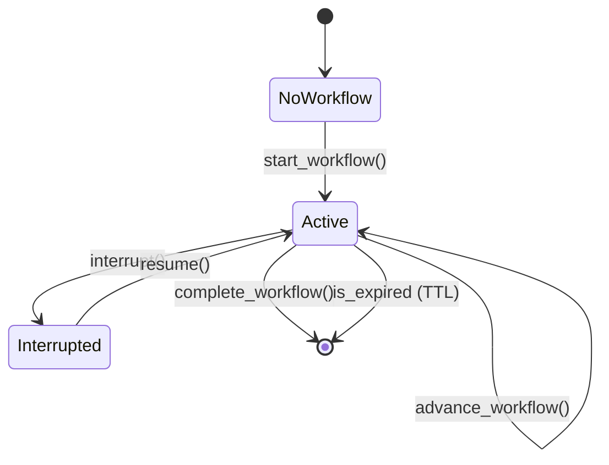

# Phase 4A: Conversation State Manager

## Objective
A dedicated state manager that persists and validates the **lifecycle of conversations** across HTTP requests. This prevents broken flows, orphaned workflows, and ensures every turn knows exactly where the user is in any multi-step journey.

---

## Why This Is Needed

Without a state manager, workflow position is passed via `workflow_state` in the LangGraph state — but that only lives for one invocation. Between turns, the state is lost unless explicitly saved. The Conversation State Manager centralizes this.

**Problems it solves:**
| Problem | Solution |
|---|---|
| Celery worker finishes but client disconnects | State persisted before response |
| User closes browser mid-order | Journey resumable next session |
| Two concurrent requests for same session | State lock prevents corruption |
| Stale workflows piling up | TTL-based expiration |

---

## Data Model

**File**: `src/services/conversation_state_manager.py`

```python
"""
Conversation State Manager
──────────────────────────────────────────────────────────────────
Centralized lifecycle manager for multi-step conversations.
Persists to MongoDB, cached in Redis for fast access.
"""

import json
from typing import Optional, Dict, Any
from datetime import datetime, timedelta
from pydantic import BaseModel, Field
from src.core.database import db
from src.core.logging_config import get_logger

logger = get_logger(__name__)

WORKFLOW_TTL_HOURS = 24  # expire stale workflows after 24h


class ConversationState(BaseModel):
    """Snapshot of a conversation's position at any point in time."""

    session_id: str
    user_id: str

    # ── Active agent tracking ──────────────────────────────────
    current_agent: Optional[str] = None        # "order_status", "create_order", etc.
    workflow_step: Optional[str] = None        # "awaiting_selection", "collecting_info", etc.
    pending_action: Optional[str] = None       # what the bot is waiting for from user

    # ── Agent-specific data ────────────────────────────────────
    agent_data: Dict[str, Any] = Field(default_factory=dict)
    # e.g. {"orders": [...], "draft_order": {...}}

    # ── Interruption tracking ──────────────────────────────────
    interrupted_from: Optional[Dict[str, Any]] = None
    # Saves {current_agent, workflow_step, agent_data} when FAQ interrupts

    # ── Metadata ───────────────────────────────────────────────
    created_at: datetime = Field(default_factory=datetime.utcnow)
    updated_at: datetime = Field(default_factory=datetime.utcnow)
    turn_count: int = 0

    @property
    def has_active_workflow(self) -> bool:
        return self.current_agent is not None and self.workflow_step is not None

    @property
    def is_interrupted(self) -> bool:
        return self.interrupted_from is not None

    @property
    def is_expired(self) -> bool:
        return (datetime.utcnow() - self.updated_at) > timedelta(hours=WORKFLOW_TTL_HOURS)


class ConversationStateManager:
    """
    CRUD operations for ConversationState.
    Reads/writes to MongoDB collection 'conversation_states'.
    """

    @property
    def collection(self):
        return db.db["conversation_states"]

    async def get(self, session_id: str) -> Optional[ConversationState]:
        """Load state for a session. Returns None if no active state."""
        doc = await self.collection.find_one({"session_id": session_id})
        if not doc:
            return None
        state = ConversationState(**doc)
        if state.is_expired:
            logger.info(f"Workflow expired for session {session_id}, clearing")
            await self.clear(session_id)
            return None
        return state

    async def save(self, state: ConversationState):
        """Upsert the conversation state."""
        state.updated_at = datetime.utcnow()
        state.turn_count += 1
        await self.collection.update_one(
            {"session_id": state.session_id},
            {"$set": state.model_dump()},
            upsert=True,
        )
        logger.info(
            f"State saved: session={state.session_id} "
            f"agent={state.current_agent} step={state.workflow_step}"
        )

    async def clear(self, session_id: str):
        """Remove state after workflow completes."""
        await self.collection.delete_one({"session_id": session_id})
        logger.info(f"State cleared for session {session_id}")

    async def interrupt(self, session_id: str):
        """
        Save current workflow into interrupted_from,
        then clear the active agent fields.
        Called when FAQ/smalltalk interrupts an active workflow.
        """
        state = await self.get(session_id)
        if not state or not state.has_active_workflow:
            return

        state.interrupted_from = {
            "current_agent": state.current_agent,
            "workflow_step": state.workflow_step,
            "agent_data": state.agent_data,
            "pending_action": state.pending_action,
        }
        state.current_agent = None
        state.workflow_step = None
        state.pending_action = None
        await self.save(state)
        logger.info(f"Workflow interrupted for session {session_id}")

    async def resume(self, session_id: str) -> Optional[Dict[str, Any]]:
        """
        Restore interrupted_from back into active agent fields.
        Returns the restored context or None if nothing to resume.
        """
        state = await self.get(session_id)
        if not state or not state.is_interrupted:
            return None

        restored = state.interrupted_from
        state.current_agent = restored["current_agent"]
        state.workflow_step = restored["workflow_step"]
        state.agent_data = restored["agent_data"]
        state.pending_action = restored.get("pending_action")
        state.interrupted_from = None
        await self.save(state)
        logger.info(f"Workflow resumed for session {session_id}")
        return restored

    async def start_workflow(
        self, session_id: str, user_id: str,
        agent: str, step: str, pending_action: str,
        data: Dict[str, Any] = None,
    ):
        """Begin a new multi-step workflow."""
        state = ConversationState(
            session_id=session_id,
            user_id=user_id,
            current_agent=agent,
            workflow_step=step,
            pending_action=pending_action,
            agent_data=data or {},
        )
        await self.save(state)

    async def advance_workflow(
        self, session_id: str, step: str,
        pending_action: str = None,
        data_updates: Dict[str, Any] = None,
    ):
        """Move the workflow to its next step."""
        state = await self.get(session_id)
        if not state:
            return
        state.workflow_step = step
        state.pending_action = pending_action
        if data_updates:
            state.agent_data.update(data_updates)
        await self.save(state)

    async def complete_workflow(self, session_id: str):
        """Mark workflow as done and clean up."""
        await self.clear(session_id)


conversation_state_manager = ConversationStateManager()
```

---

## Integration with Orchestrator (Phase 4)

The orchestrator uses the state manager instead of raw `workflow_state` dict:

```python
# In check_pending_workflow_node:
state_mgr = conversation_state_manager
conv_state = await state_mgr.get(session_id)

if conv_state and conv_state.has_active_workflow:
    # Route directly to the active agent
    return {
        "workflow_state": {
            "agent": conv_state.current_agent,
            "step": conv_state.workflow_step,
            "data": conv_state.agent_data,
        }
    }

# In save_interruption_node:
await state_mgr.interrupt(session_id)

# In resume_node:
restored = await state_mgr.resume(session_id)

# After agent completes:
await state_mgr.complete_workflow(session_id)
```

---

## State Lifecycle


