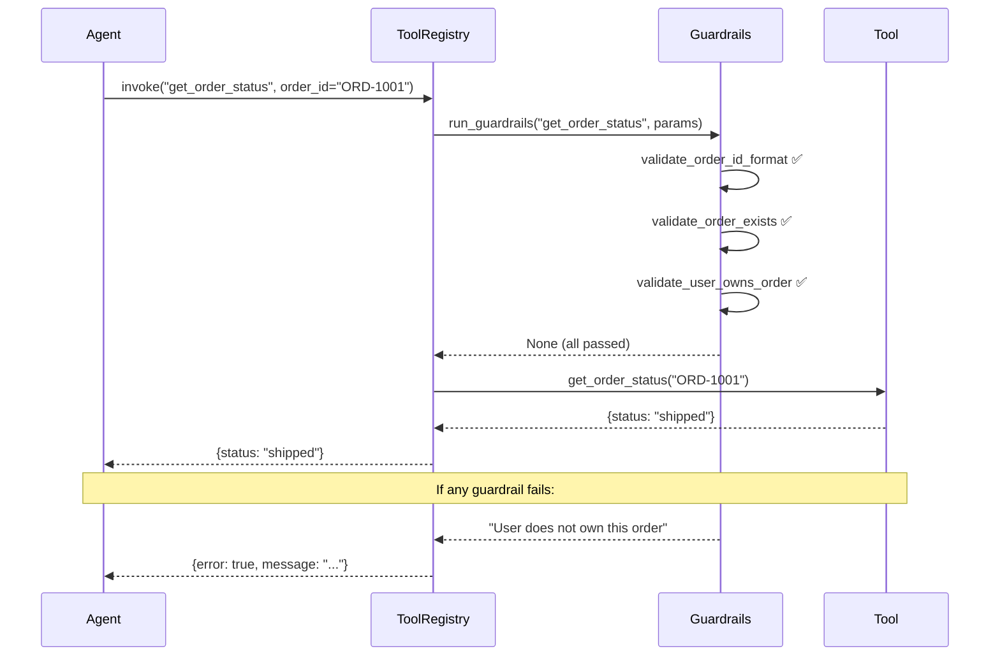

# Phase 4C: Tool Guardrails — Pre-Invocation Validation

## Objective
Add a validation layer that runs **before** every tool call to prevent invalid, unauthorized, or malicious operations. No tool executes without passing its guardrails first.

---

## Why This Is Needed

Without guardrails, an LLM hallucinating an order ID or a spoofed user ID can trigger real tool calls:

| Risk | Example | Guardrail |
|---|---|---|
| Non-existent resource | `get_order_status("FAKE-123")` | Check order exists before calling |
| Unauthorized access | User A queries User B's orders | Verify user owns the order |
| Invalid params | `create_draft_order(quantity=-5)` | Schema validation |
| Rate abuse | 100 `search_knowledge_base` calls/sec | Rate limiting |
| SQL/NoSQL injection | `order_id: {"$gt": ""}` | Type + format enforcement |

---

## Guardrail Chain Implementation

**File**: `src/tools/guardrails.py`

```python
"""
Tool Guardrails — Pre-invocation validation chain.
──────────────────────────────────────────────────────────────────
Each guardrail is a function that takes (tool_name, params, context)
and raises GuardrailError if the call should be blocked.
"""

from typing import Dict, Any, List, Callable, Optional
from dataclasses import dataclass
from src.core.logging_config import get_logger

logger = get_logger(__name__)


class GuardrailError(Exception):
    """Raised when a guardrail blocks a tool call."""
    def __init__(self, tool_name: str, reason: str):
        self.tool_name = tool_name
        self.reason = reason
        super().__init__(f"Guardrail blocked '{tool_name}': {reason}")


@dataclass
class GuardrailContext:
    """Context passed to every guardrail check."""
    user_id: str
    session_id: str
    tool_name: str
    params: Dict[str, Any]


# ── Type alias for guardrail functions ─────────────────────────
GuardrailFn = Callable[[GuardrailContext], None]  # raises GuardrailError


# ════════════════════════════════════════════════════════════════
#  BUILT-IN GUARDRAILS
# ════════════════════════════════════════════════════════════════

def validate_order_id_format(ctx: GuardrailContext):
    """Ensure order_id matches expected format: ORD-XXXXXX."""
    order_id = ctx.params.get("order_id", "")
    if order_id and not order_id.startswith("ORD-"):
        raise GuardrailError(
            ctx.tool_name,
            f"Invalid order ID format: '{order_id}'. Expected 'ORD-XXXXXX'."
        )


def validate_order_exists(ctx: GuardrailContext):
    """Check that the order_id references a real order."""
    from src.tools.order_tools import MOCK_ORDERS
    order_id = ctx.params.get("order_id", "")
    if not order_id:
        return

    found = any(
        order_id == o["order_id"]
        for orders in MOCK_ORDERS.values()
        for o in orders
    )
    if not found:
        # Also check MCP drafts
        from src.tools.mcp_tools import _drafts
        if order_id not in _drafts:
            raise GuardrailError(
                ctx.tool_name,
                f"Order '{order_id}' does not exist."
            )


def validate_user_owns_order(ctx: GuardrailContext):
    """Verify the current user has access to the requested order."""
    from src.tools.order_tools import MOCK_ORDERS
    order_id = ctx.params.get("order_id", "")
    user_id = ctx.user_id
    if not order_id:
        return

    user_orders = MOCK_ORDERS.get(user_id, [])
    user_order_ids = {o["order_id"] for o in user_orders}

    # Also allow access to their own drafts
    from src.tools.mcp_tools import _drafts
    if order_id in _drafts:
        return  # drafts are session-scoped, allow

    if order_id not in user_order_ids:
        raise GuardrailError(
            ctx.tool_name,
            f"User '{user_id}' does not own order '{order_id}'."
        )


def validate_positive_quantity(ctx: GuardrailContext):
    """Ensure quantity is a positive integer."""
    quantity = ctx.params.get("quantity")
    if quantity is not None:
        if not isinstance(quantity, int) or quantity <= 0:
            raise GuardrailError(
                ctx.tool_name,
                f"Quantity must be a positive integer, got: {quantity}"
            )


def validate_address_not_empty(ctx: GuardrailContext):
    """Ensure shipping address is provided."""
    address = ctx.params.get("address", "")
    if not address or not address.strip():
        raise GuardrailError(
            ctx.tool_name,
            "Shipping address cannot be empty."
        )


def validate_query_not_empty(ctx: GuardrailContext):
    """Ensure search query is not empty."""
    query = ctx.params.get("query", "")
    if not query or not query.strip():
        raise GuardrailError(
            ctx.tool_name,
            "Search query cannot be empty."
        )


# ════════════════════════════════════════════════════════════════
#  GUARDRAIL REGISTRY
# ════════════════════════════════════════════════════════════════

# Maps tool_name -> list of guardrail functions to run before invocation
TOOL_GUARDRAILS: Dict[str, List[GuardrailFn]] = {
    "get_order_status": [
        validate_order_id_format,
        validate_order_exists,
        validate_user_owns_order,
    ],
    "confirm_order": [
        validate_order_id_format,
        validate_order_exists,
    ],
    "create_draft_order": [
        validate_positive_quantity,
        validate_address_not_empty,
    ],
    "search_knowledge_base": [
        validate_query_not_empty,
    ],
    "list_orders": [],  # no guardrails needed — user_id comes from session
    "check_inventory": [],  # autonomous, no user input
}


def run_guardrails(
    tool_name: str,
    params: Dict[str, Any],
    user_id: str,
    session_id: str,
) -> Optional[str]:
    """
    Run all guardrails for a tool. Returns None if all pass,
    or an error message string if blocked.
    """
    guardrails = TOOL_GUARDRAILS.get(tool_name, [])
    ctx = GuardrailContext(
        user_id=user_id,
        session_id=session_id,
        tool_name=tool_name,
        params=params,
    )

    for guard in guardrails:
        try:
            guard(ctx)
        except GuardrailError as e:
            logger.warning(f"Guardrail blocked: {e}")
            return e.reason

    return None  # all passed
```

---

## Integration with Tool Registry (Phase 4B)

Update `ToolRegistry.invoke()` to run guardrails automatically:

```python
# In src/tools/registry.py — updated invoke method:

from src.tools.guardrails import run_guardrails

async def invoke(
    self, name: str,
    user_id: str = "", session_id: str = "",
    **kwargs
) -> Any:
    tool = self.get(name)
    if not tool:
        raise ValueError(f"Tool '{name}' is not registered")

    # ── Guardrail check ────────────────────────────────────
    if tool.requires_auth or name in TOOL_GUARDRAILS:
        error = run_guardrails(name, kwargs, user_id, session_id)
        if error:
            return {"error": True, "message": error}

    # ── Validate params ────────────────────────────────────
    missing = self.validate_params(name, kwargs)
    if missing:
        raise ValueError(f"Tool '{name}' missing: {missing}")

    # ── Invoke ─────────────────────────────────────────────
    result = await tool.handler(**kwargs)
    return result
```

---

## Agent Usage with Guardrails

Agents don't need to know about guardrails — the registry handles everything:

```python
async def get_status_node(state: AgentState):
    result = await tool_registry.invoke(
        "get_order_status",
        user_id=state["user_id"],
        session_id=state["session_id"],
        order_id=selected_order_id,
    )

    # If guardrail blocked the call:
    if isinstance(result, dict) and result.get("error"):
        return {"assistant_response": f"⚠️ {result['message']}"}

    # Normal success path:
    return {"assistant_response": f"Order status: {result['status']}"}
```

---

## Guardrail Flow


